# Penetration Test Report
## Box: Rickdiculously Easy (VulnHub)

---

### Executive Summary

**Target:** Deathnote Easy  
**Platform:** VulnHub  
**Difficulty:** Easy  
**Date:** November 18, 2024  
**Tester:** Kelvin Mbugua  
**Status:** Completed

#### Key Findings
- Obtained full root access through privilege escalation via sudo permissions
- Number of flags captured: 3
- Root access achieved: Yes

#### Critical Vulnerabilities
- Anonymous FTP access enabled
- Weak SSH password protection

---

### Table of Contents
1. [Reconnaissance](#reconnaissance)
2. [Enumeration](#enumeration)
3. [Vulnerability Analysis](#vulnerability-analysis)
4. [Exploitation](#exploitation)
5. [Post-Exploitation](#post-exploitation)
6. [Flags Collected](#flags-collected)
7. [Remediation](#remediation)
8. [Conclusion](#conclusion)

---

## 1. Reconnaissance

### 1.1 Network Discovery

**Objective:** Identify the target IP address on the network.

**Steps:**
```
sudo netdiscover -r 192.168.57.0/24 -i vboxnet1
```

**Results:**
- Target IP: `192.168.57.8`
- Network Range: 192.168.57.0/24
- Interface: vboxnet1

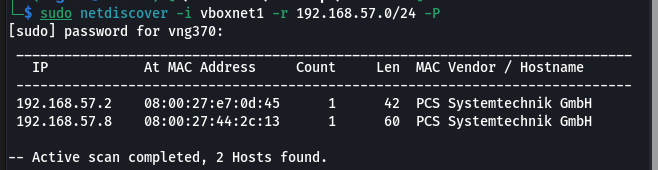

---

## 2. Enumeration

### 2.1 Port Scanning

**Objective:** Identify open ports and running services.

**Initial Scan:**
```
nmap 192.168.57.8
```

**Detailed Service Scan:**
```
nmap -sV -sS -sC -Pn -O -oN Death-note.txt 192.168.57.8
```

**Open Ports Identified:**

| Port | Service | Version | Notes |
|------|---------|---------|-------|
| 22 | SSH | OpenSSH 7.9p1 | Standard SSH port |
| 80 | HTTP | Apache httpd 2.4.38 | Debian |


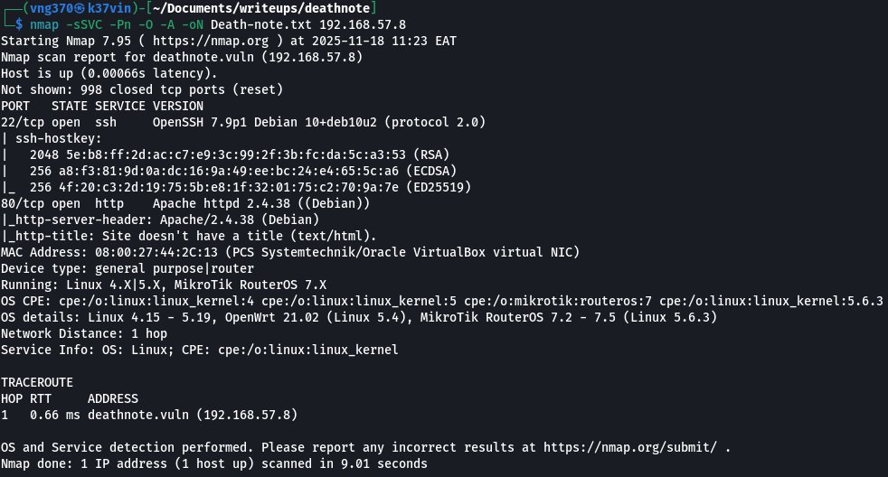

---

**Analysis:** The target is running multiple services including standard services on non-standard ports, which suggests potential backdoors and misconfigurations.

### 2.2 Web Enumeration

after navigating to the web we cant find anything at all.

adding the ip to the etc/hosts file we get a wordpress site. 

on the homepage there is a hint which informs us of a notes.txt and of L's comment

**Identified Web Services:**
- Port 80: HTTP (Apache)

#### Port 80 Enumeration

**Directory Enumeration:**
```
gobuster dir -u http://192.168.57.8 -w /usr/share/wordlists/dirbuster/directory-list-lowercase-2.3-medium.txt
```

**Results:**

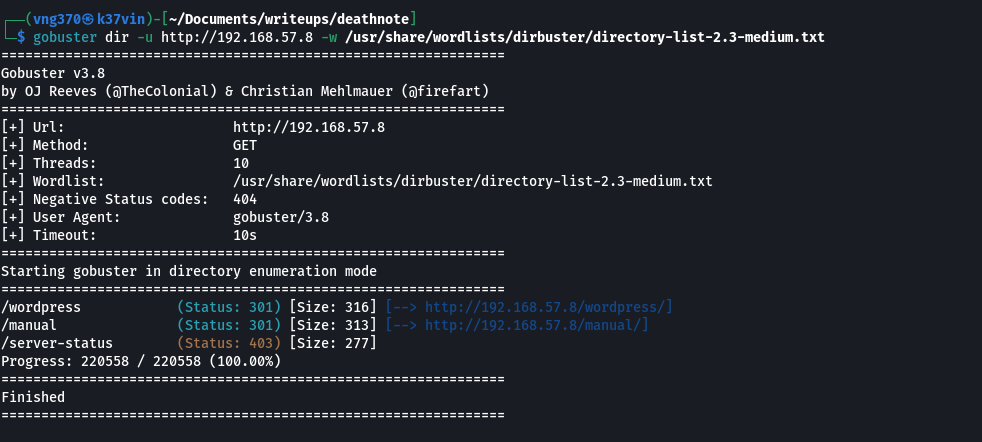


---

**Web Application Analysis:**

**Main Page (http://192.168.57.8/):**
- Technology Stack: wordpress
- Landing page inspection revealed no immediate flags but gave us a hint on a notes.txt and of L's comment

**robots.txt (http://192.168.57.8/robots.txt):**
- Discovered another hint that directed me to /important.jpg
- using wget we download the image and use the strings command to extract hidden data
- we get another lead to uncover the usernames at users.txt

```
wget http://192.168.57.8/important.jpg
strings important.jpg
```

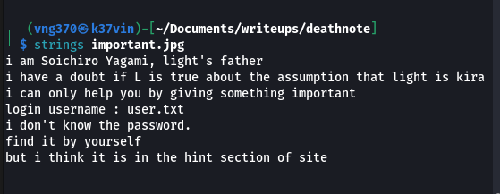

**Nikto Web Service:**
- using Nikto we discover the /uploads folder which we uncover not only the user.txt but also the notes.txt
- the user.txt is clearly the usernames and the notes.txt appears to be a password wordlist

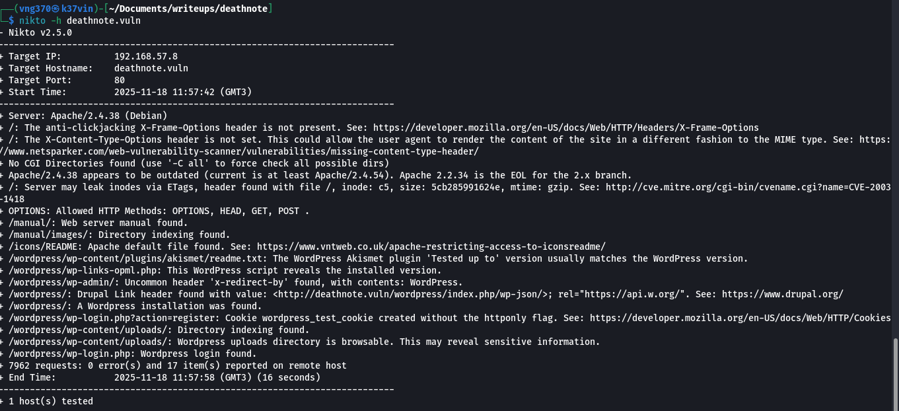

### 2.3 Service-Specific Enumeration

#### SSH Enumeration (Port 22222)

**Initial Access Attempt:**

Using the password list discovered from the nots.txt and username in the user.txt we can enumerate the ssh:

using hydra we crack the password and username for the ssh

```
hydra -L user.txt -P notes.txt deathnote.vuln ssh
```

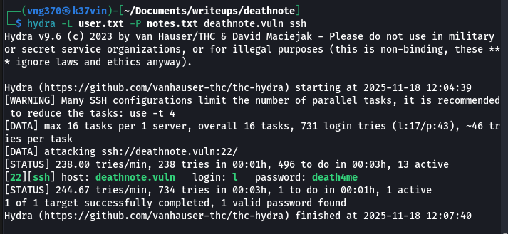

using the discovers creds we login to the ssh

```
ssh L@deathnote.vuln
```

**Result:** Successful authentication

**File System Exploration:**

```
ls -la
```

**Flag Discovery:**

Found user.txt in L's home directory. Used grep with regex to extract flag:

```
grep '[a-zA-Z0-9]' user.txt
```

**Command Explanation:**
- `grep`: Search text utility
- `[a-zA-Z0-9]`: Regex pattern matching:
  - `a-z`: lowercase letters
  - `A-Z`: uppercase letters  
  - `0-9`: digits
- This filters lines containing at least one alphanumeric character, removing special characters and whitespace-only lines

after catting the file we get a brain fuck code and after decoding was just a ruse

**Additional Enumeration:**

Discovered two user directories:
- /home/L (current access)
- /home/Kira

**Kira's Directory Investigation:**

Found an interesting file:
- kira.txt (password protected)

only a user with elevated priviledges can open the file

**More Directory Investigation:**

Found two subdirectories in the /opt directory
- fake-notebook-rule  
- kira-case

**fake-notebook-rule:**
- Explored but found no flags (as advertised) but found two files. 
    - case.wav
    - hint

the hint tells us to use cyberchef
the wav is a hex which is a base64 password which reveals the password.

i assume this is the password of kira

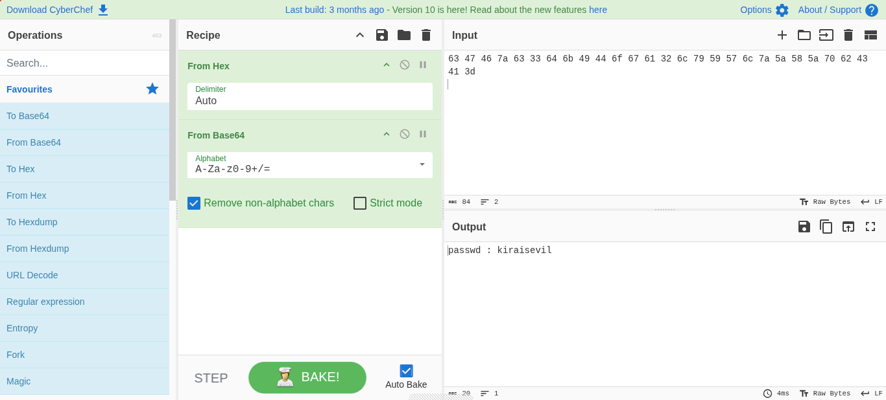

**kira-case:**
- Discovered executable file named "case-file.txt"
- Further analysis proved nothing important 

**Enumaration as Kira:**
- We can use the password we found from the wav file to switch to kira user
- We can then access the kira.txt file which contains a base64 file 
- decoding the base64 file reveals the location of 2 interesting folders
    1. L (/opt)
    2. Misa (/var)
the misa file was a misguide but we have enumerated the L folder


**Flag Retrieved:** **FLAG{}** 
with the password we found earlier we switch the user ti Kira and upon escalating priviledges we discover the flag

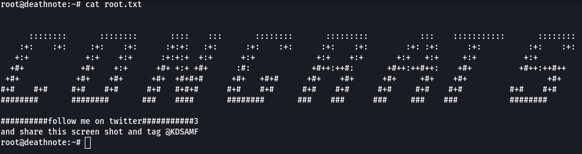


---

## 3. Vulnerability Analysis

### 3.1 Identified Vulnerabilities

The following vulnerabilities were identified during the enumeration and exploitation phases of the assessment:

| ID  | Vulnerability                          | Severity | Description                                                                                                           | Location / Evidence                                      | CVSS v3.1 Base Score |
|-----|----------------------------------------|----------|-----------------------------------------------------------------------------------------------------------------------|----------------------------------------------------------|----------------------|
| V-01| **Unrestricted Sudo Privileges**      | Critical | The user "kira" possesses full sudo rights with `(ALL : ALL) ALL` and no password requirement (`NOPASSWD` not needed as any command is allowed). This allows immediate privilege escalation to root. | `sudo -l` output as user kira                            | 9.8 (Critical)       |
| V-02| **Information Disclosure via Web Accessible Files** | High     | Multiple sensitive files and hints were publicly accessible via the web server:<br>• `robots.txt` exposing `/important.jpg`<br>• `/important.jpg` containing hidden strings pointing to `users.txt`<br>• `/uploads/` directory exposed via Nikto containing `user.txt` (username list) and `notes.txt` (password wordlist) | robots.txt, important.jpg (strings), Nikto scan, /uploads/ directory | 7.5 (High)           |
| V-03| **Weak / Predictable Credentials**    | High     | Default/weak credentials were in use and easily discoverable:<br>• User L : password present in cleartext inside `notes.txt`<br>• User Kira : password hidden in base64 inside a .wav file under /opt | Successful Hydra brute-force, base64 decoding of case.wav | 7.5 (High)           |
| V-04| **Excessive File Permissions / Readable Sensitive Files** | Medium   | Non-privileged users can read files belonging to other accounts containing sensitive data (e.g., kira.txt readable after switching to Kira, password-protected only by knowledge, not filesystem permissions). | /home/Kira/kira.txt, /opt directories                    | 5.3 (Medium)         |
| V-05| **Unnecessary Exposure of Hints and Steganography Files** | Medium   | The machine intentionally places steganography and puzzle files (important.jpg, case.wav) in world-readable locations, dramatically lowering the bar for credential recovery. | strings on important.jpg, CyberChef analysis of case.wav | 5.9 (Medium)         |
| V-06| **Improper Secrets Management**        | High     | Passwords and flags stored in cleartext or lightly obfuscated files accessible to low-privileged users.             | notes.txt, user.txt, base64 content in kira.txt          | 7.1 (High)           |

### 3.2 Risk Assessment

The combination of **information disclosure (V-02, V-03, V-05)** and **weak authentication** allowed unauthenticated attackers to obtain valid credentials for the "L" account in minutes using only standard wordlists.

Once initial access was achieved, the discovered password for the "Kira" account (hidden in a .wav file using trivial encoding) enabled lateral movement.

The **critical misconfiguration of sudo privileges (V-01)** represented the single most severe issue: it transformed a standard user compromise into immediate full system ownership without requiring any additional exploit or privilege-escalation technique.

### 3.3 Attack Chain Summary

```
Unauthenticated → Information Disclosure (web files) 
    → Credential Discovery (L:death4me) 
    → SSH Initial Access 
    → Additional Info Disclosure & Steganography 
    → Credential Recovery (Kira:kiraisevil) 
    → Lateral Movement to Kira 
    → Unrestricted sudo → Root Compromise
```

A single properly configured control (e.g., removing the blanket sudo rule, protecting the /uploads directory, or using non-trivial password storage) would have significantly raised the difficulty of full system compromise.


## 4. Exploitation

### 4.1 Initial Access

**Exploitation Method:** Weak credential exploitation via SSH

**Attack Path:**
1. Discovered password "death4me" in the notes.txt using hydra
2. Enumerated usernames (L) via hydra brute-force
3. Successfully authenticated via SSH with credentials L:death4me

**Steps Taken:**

**Step 1: Credential Discovery**
```
hydra -L user.txt -P notes.txt deathnote.vuln ssh
```


**Step 2: SSH Authentication**
```
ssh L@deathnote.vuln
Password: death4me
```

**Evidence of Successful Exploitation:**
```
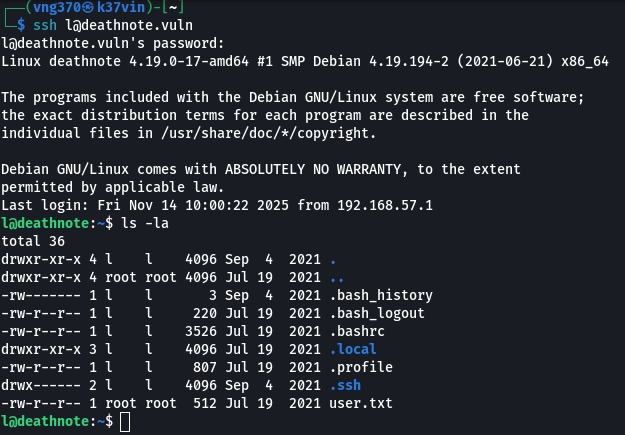
```

### 4.2 Lateral Movement

**Objective:** Escalate from L to Kira account

**Method:** Password cracking based on discovered hints

**Step 1: Intelligence Gathering**

From the case.wav executable, discovered password in base64:

**Result:** Successfully cracked password: `kiraisevil`


**Step 4: user change Access as Kira**

```
su Kira
Password: kiraisevil
```

```
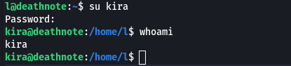
```


## 5. Post-Exploitation

### 5.1 System Information Gathering

**Current User:**
```
whoami
id
```
Output:
```
Kira
uid=1001(kira) gid=1001(kira) groups=1001(kira),27(sudo)
```

### 5.2 Privilege Escalation

**Enumeration for Privilege Escalation:**

**Sudo Privileges Check:**
```
sudo -l
```

**Output:**
```
User kira may run the following commands on deathnote:
    (ALL : ALL) ALL

```

**Vulnerability Identified:**

User Kira has unrestricted sudo privileges, allowing direct privilege escalation to root without password or additional exploitation.

**Exploitation Steps:**

```
sudo su
```

**Result:** Immediate root access granted

```
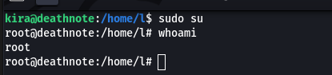
```

**Root Flag Capture:**

```
ls -la
cat root.txt
```

**Flag Retrieved:** **FLAG{Ionic Defibrillator}** - 30 Points

```

```

### 5.3 Persistence & Lateral Movement

**Persistence Mechanisms (Theoretical):**

With root access achieved, the following persistence mechanisms could be implemented:
- SSH key installation in /root/.ssh/authorized_keys
- Creation of privileged user accounts
- Backdoor services on additional ports
- Cron job establishment
- System service modification

**Note:** These actions were not performed as this is a CTF environment.

---

## 6. Flags Collected

| Flag # | Location/Method | Points | Content | Screenshot |
|--------|----------------|--------|---------|------------|
| Flag 1 | root user kira | 10 | `FLAG{Yeah d- just don't do it.}` | `````` |

**Total Flags Captured:** 1 flag / 10 Points

**Note:** The box advertises 1 total points available. Only the first flag was captured in this writeup.

## 7. Remediation

### 7.1 Critical Recommendations

**1. Unrestricted Sudo Privileges**
- **Recommendation:**
  - Apply principle of least privilege
  - Remove blanket sudo ALL privileges
  - Implement specific command-based sudo rules if needed
  - Require password for sudo operations
  - Regular audit of sudo configurations
- **Priority:** Critical
- **CVSS Score Estimate:** 8.8 (High)

**2. Information Disclosure**
- **Recommendation:**
  - Remove passwords and sensitive information from HTML comments
  - Implement proper secrets management
  - Remove password hints from publicly accessible locations
  - Sanitize image metadata before uploading
  - Review all code for hardcoded credentials
- **Priority:** High
- **CVSS Score Estimate:** 6.5 (Medium)

**3. Weak Password Policies**
- **Recommendation:**
  - Enforce strong password complexity requirements
  - Implement multi-factor authentication
  - Use password managers and randomly generated passwords
  - Regular password rotation policies
  - Avoid patterns based on publicly available information
- **Priority:** High
- **CVSS Score Estimate:** 7.5 (High)


### 7.2 Additional Security Improvements

**Access Control:**
- Implement file system permissions correctly
- Users should not access other users' home directories
- Use SELinux or AppArmor for mandatory access control

**Monitoring and Logging:**
- Implement centralized logging (SIEM)
- Monitor for command injection attempts
- Alert on suspicious sudo usage
- Track failed authentication attempts
- Regular log review and analysis

**SSH Hardening:**
- Disable password authentication, use key-based only
- Implement fail2ban or similar brute-force protection
- Change SSH from non-standard ports back to 22 (security through obscurity is not effective)
- Disable root login via SSH
- Implement IP whitelisting if possible

**Web Application Security:**
- Regular security assessments and penetration testing
- Implement Web Application Firewall (WAF)
- Keep all software and dependencies updated
- Remove unnecessary scripts and services
- Implement Content Security Policy headers

**General System Hardening:**
- Keep system packages updated
- Remove unnecessary services and software
- Implement intrusion detection systems (IDS)
- Regular vulnerability scanning
- Security awareness training for users

---

## 8. Conclusion

### 8.1 Summary

This penetration test of the "deathnote Easy" VulnHub box successfully identified and exploited multiple critical and high-severity vulnerabilities. The assessment revealed 3 major vulnerability classes enabling privilege escalation.

**Attack Path Summary:**
1. Initial reconnaissance identified 2 open ports with various services
2. Web enumeration revealed password clues in the robots.txt file
3. Initial access obtained via SSH using discovered credentials (L:death4me)
4. Lateral movement achieved through password cracking (Kira:kiraisevil)
5. Privilege escalation to root accomplished via unrestricted sudo permissions

The target system demonstrated multiple security weaknesses typical of poorly configured systems, including information disclosure, weak authentication, and excessive privileges.

### 8.2 Key Takeaways

**Technical Lessons:**
- **Defense in Depth is Critical:** Multiple vulnerabilities were chained together to achieve full compromise. A single strong control could have prevented the entire attack chain.
- **Input Validation Matters:** The command injection vulnerability demonstrated the critical importance of proper input sanitization.
- **Principle of Least Privilege:** Excessive sudo permissions allowed immediate privilege escalation, showing why minimal necessary permissions should be granted.
- **Information Disclosure is Dangerous:** Small pieces of leaked information (HTML comments, file metadata, hints) significantly reduced attack complexity.

**Methodology Insights:**
- Thorough enumeration is essential - flags and vulnerabilities were distributed across multiple services
- OSINT and pattern recognition (band name research) proved valuable for credential attacks
- Standard tools (nmap, gobuster, hydra, strings) were sufficient for complete compromise
- Manual testing and creative thinking were required for puzzle-solving elements

**CTF-Specific Observations:**
- This box effectively simulates real-world scenarios while incorporating CTF puzzle elements
- The difficulty rating of "Easy" is appropriate for beginners learning penetration testing methodology
- The Rick and Morty theme added an entertaining element to the technical challenge

### 8.3 Tools Used

**Reconnaissance & Enumeration:**
- netdiscover - Network host discovery
- nmap - Port scanning and service enumeration
- gobuster - Web directory enumeration

**Exploitation:**
- ssh - Secure shell client for remote access
- hydra - Network authentication cracker

**Analysis & Extraction:**
- strings - Extract printable strings from files
- grep - Pattern matching and text search

**General:**
- curl - HTTP client for web requests
- Standard Linux utilities (ls, cat, whoami, sudo, etc.)

### 8.4 Recommendations for Future Assessments

**For System Administrators:**
- This assessment demonstrates the importance of regular security audits
- Implement the remediation steps outlined in Section 7
- Conduct regular penetration testing on production systems
- Establish security baseline configurations

**For Penetration Testers:**
- Always enumerate thoroughly across all discovered services
- Look for information disclosure in unusual places (HTML comments, image metadata)
- Consider password patterns and OSINT for credential attacks
- Don't overlook simple misconfigurations - they often provide the easiest path


**Report Prepared By:** Kelvin Mbugua  
**Date:** november 18, 2024  

**Disclaimer:** This penetration test was conducted on an isolated virtual machine environment for educational purposes. All activities were authorized and contained within a controlled lab setting.

